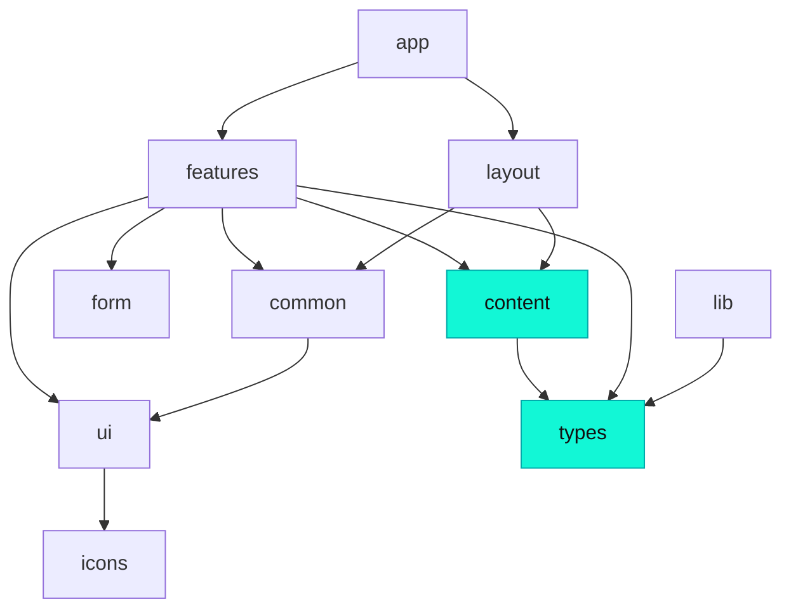

<div align="center">

# Minhazur Rahman — Portfolio

**A personal portfolio evolving into a software‑agency site, engineered as an AI‑ready codebase.**

Built with the Next.js App Router, a strictly‑enforced feature‑based architecture, and an agent‑agnostic workflow that keeps every contribution — human or AI — consistent.

<br />

[](https://nextjs.org/)
[](https://www.typescriptlang.org/)
[](https://tailwindcss.com/)
[](https://www.framer.com/motion/)
[](./LICENSE)

</div>

---

## ✨ Highlights

- **Feature‑first architecture** — each page section is a self‑contained module under `src/features/*`, exposed through a single public barrel.
- **Boundaries that can't be crossed by accident** — architectural rules (which layer may import which) are enforced by ESLint and fail the commit, not just documented.
- **Data / UI separation** — all portfolio content lives as pure, serializable data in `src/content` — ready to power an AI "chat with me" feature.
- **Agent‑agnostic by design** — one `AGENTS.md` source of truth, read by Claude, Cursor, Copilot, Gemini and others via thin pointer files.
- **Consistency at the tooling layer** — Prettier, ESLint, Husky, lint‑staged and commitlint enforce style + Conventional Commits for every author.
- **Motion with restraint** — `framer-motion`'s `LazyMotion` for a lean bundle, with `prefers-reduced-motion` respected globally.

## 🛠 Tech stack

| Area          | Choice                                                    |
| ------------- | --------------------------------------------------------- |
| Framework     | **Next.js 14** (App Router, RSC)                          |
| Language      | **TypeScript** (strict)                                   |
| Styling       | **Tailwind CSS** with a fixed, semantic palette           |
| Animation     | **framer-motion** (`LazyMotion` + `m`)                    |
| Forms         | **react-hook-form** + **zod**                             |
| UI primitives | **shadcn/ui** seam scaffolded (`components.json`, `cn()`) |
| Analytics     | **@vercel/analytics**                                     |
| Deploy        | **Vercel**                                                |

## 🏗 Architecture

The app is organized **feature‑first** under `src/`, with a strict dependency direction between layers.

```
src/
├── app/                 # routes only — layouts, pages, (future) api handlers
├── components/
│   ├── ui/              # shadcn/ui primitives (owned, restyleable)
│   ├── common/          # cross-feature composites (Reveal, Title, …)
│   ├── form/            # shared form primitives
│   ├── layout/          # global chrome (Navbar, Footer)
│   └── icons/           # custom SVG icon components
├── features/            # one self-contained module per page section
│   └── <name>/
│       ├── components/  # feature-only components
│       └── index.ts     # PUBLIC entry point — the only import surface
├── content/             # portfolio data (pure & serializable) → future RAG source
├── lib/                 # shared utils/clients (cn, fonts)
├── types/               # shared domain types
└── hooks/               # shared hooks
```

**Import boundaries** are enforced by [`eslint-plugin-boundaries`](https://github.com/javierbrea/eslint-plugin-boundaries) — a violation fails `npm run lint` (and the pre‑commit hook):



Rules of thumb: features never import each other (shared code moves up to `components/` or `lib/`); `content` is data‑only; filenames and folders are **kebab‑case**. The full matrix lives in [`AGENTS.md`](./AGENTS.md).

## 🤖 AI‑ready workflow

This repo is set up so that **any** coding agent produces consistent, in‑architecture code.

- **[`AGENTS.md`](./AGENTS.md)** — the single source of truth for architecture, conventions, and commit rules. Tool‑specific files (`CLAUDE.md`, `.cursor/rules`, `.github/copilot-instructions.md`, `GEMINI.md`, `.windsurf`, `.clinerules`) are thin pointers to it.
- **Skills** — reusable procedures in `.claude/skills/` (scaffold a feature, add content, verify, ship, audit structure) plus vendored knowledge skills in `.agents/skills/` (`frontend-design`, `vercel-react-best-practices`), readable across agents.
- **Enforcement, not suggestion** — style and Conventional Commits are enforced by Husky hooks + commitlint, so the rules hold no matter who (or what) writes the code.

## 🚀 Getting started

**Prerequisites:** Node `>= 20` (see [`.nvmrc`](./.nvmrc)) and npm.

```bash
# 1. Install dependencies (also sets up git hooks via "prepare")
npm install

# 2. Configure environment
cp .env.example .env.local
# then fill in the contact-form values:
#   NEXT_PUBLIC_FORM_API_URL
#   NEXT_PUBLIC_FORM_API_KEY

# 3. Run the dev server
npm run dev
```

Open [http://localhost:3000](http://localhost:3000).

> ✏️ To change what the site displays, edit the typed data in **`src/content/`** (profile, projects, experience, skills) — not the JSX.

## 📜 Scripts

| Script              | Description                                     |
| ------------------- | ----------------------------------------------- |
| `npm run dev`       | Start the dev server                            |
| `npm run build`     | Production build                                |
| `npm run start`     | Serve the production build                      |
| `npm run lint`      | ESLint (incl. architecture + naming rules)      |
| `npm run typecheck` | `tsc --noEmit`                                  |
| `npm run format`    | Format with Prettier (`format:check` to verify) |
| `npm run verify`    | Aggregate gate: typecheck → lint → build        |

## 🧭 Conventions

- **Commits** follow [Conventional Commits](https://www.conventionalcommits.org/) (`feat`, `fix`, `refactor`, `chore`, …) — enforced by commitlint.
- **Files & folders** are kebab‑case; component/hook exports stay PascalCase/camelCase.
- **Client vs server** — components are server by default; add `"use client"` only when hooks, browser APIs, or `framer-motion` are used.
- Import shared code through barrels (`@/components/common`, `@/features/<name>`, `@/content/*`, `@/types`), never deep paths.

Full details in [`AGENTS.md`](./AGENTS.md).

## 🗺 Roadmap

- [ ] UI redesign into a distinctive agency + portfolio experience (guided by the `frontend-design` skill)
- [ ] Real project case studies, services, and testimonials
- [ ] **"Chat with me"** — a RAG‑powered assistant answering from `src/content` (`src/features/chat` + `src/app/api/chat` + `src/lib/ai`)

## 📄 License

[MIT](./LICENSE) © Minhazur Rahman

<div align="center">
<sub>Frontend engineer • building high‑quality web experiences</sub>
</div>
